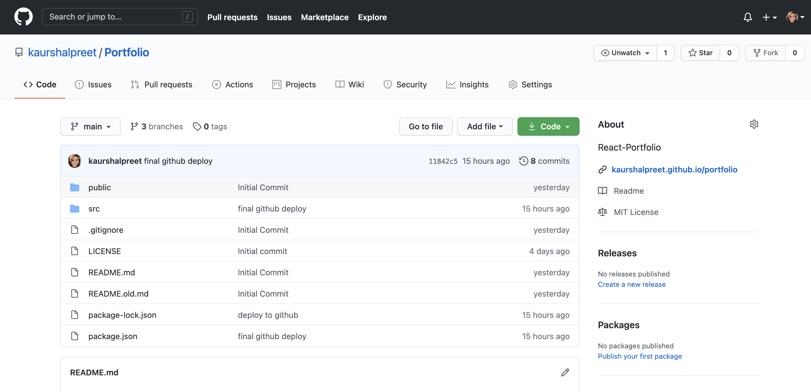

# Portfolio
React-Portfolio

## Description
 This is an application showcasing my Bio, Portfolio and Contact pages using React. [The project can be accessed at my github repository](https://github.com/kaurshalpreet/Portfolio)
 
 

 ---

# Table of Contents
1. [Getting Started](#GettingStarted)
1. [Running the application](#Runningtheapplication)
1. [Responsive Layout](#ResponsiveLayout)
1. [Credits](#Credits)
---

## Getting Started
This is 3 page application.
Each page has a consistent navigation bar and a sticky footer. Each page has a link to navigate to other pages.

---

"About Me" is the main page about myself and has links to my LinkedIn & Github profiles. There is also a link to my resume just next to Github and linkedIn icons. You need to click on the icons/images which will redirect you to my Github and linkedIn profiles and Resume. You can also find my email address and Contact number on this page.
[About Me Page](https://kaurshalpreet.github.io/Portfolio/#/)

---

"Portfolio" features my recent projects. You can find the links to my Github repositories and the Links to deployed Projects on this page. By simply Clicking on the images/screenshots or gifs will redirect you to the deployed page.
[Portfolio Page](https://kaurshalpreet.github.io/Portfolio/#/portfolio)

---

"Contact" provides the option to contact me through the webpage.
[Contact Page](https://kaurshalpreet.github.io/Portfolio/#/contact)

---

Each page is designed to be responsive for mobile screen. Below images show the different view on  a large screen vs a small screen.

  |  

---

## Running the Application

[My PORTFOLIO can be accessed here](https://kaurshalpreet.github.io/Portfolio/#/)

The index.html has links to my LinkedIn & Github profiles as well as my email address and Contact number. You can also navigate to portfolio and contact pages.

---

## Responsive Layout
The webpages are designed to be responsive for viewing on mobile devices. On an `xs` screen, content takes up the entire screen. On `sm` and larger screens, some margins on the left and right sides of the screen will be observed.

When viewed on mobile device, the navigation links get collaopsed into a navigation icon. When clicked on the navigation icon, it displays the navigation menu.

The images also display responsive behavior when viewed on small screen.

---

## Credits
* UC Davis BootCamp-Instructor & TAs!
* https://getbootstrap.com/
* https://www.youtube.com/watch?v=5GcQtLDGXy8
* https://www.youtube.com/watch?v=cHAcSQyvBqQ
* https://www.google.com/

Copyright  &copy;2020 Shalpreet Kaur

Permission is hereby granted, free of charge, to any person obtaining a copy of this software and associated documentation files (the "Software"), to deal in the Software without restriction, including without limitation the rights to use, copy, modify, merge, publish, distribute, sublicense, and/or sell copies of the Software, and to permit persons to whom the Software is furnished to do so, subject to the following conditions:

The above copyright notice and this permission notice shall be included in all copies or substantial portions of the Software.

THE SOFTWARE IS PROVIDED "AS IS", WITHOUT WARRANTY OF ANY KIND, EXPRESS OR IMPLIED, INCLUDING BUT NOT LIMITED TO THE WARRANTIES OF MERCHANTABILITY, FITNESS FOR A PARTICULAR PURPOSE AND NONINFRINGEMENT. IN NO EVENT SHALL THE AUTHORS OR COPYRIGHT HOLDERS BE LIABLE FOR ANY CLAIM, DAMAGES OR OTHER LIABILITY, WHETHER IN AN ACTION OF CONTRACT, TORT OR OTHERWISE, ARISING FROM, OUT OF OR IN CONNECTION WITH THE SOFTWARE OR THE USE OR OTHER DEALINGS IN THE SOFTWARE.

 
